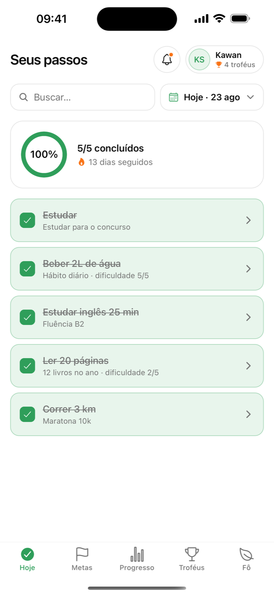
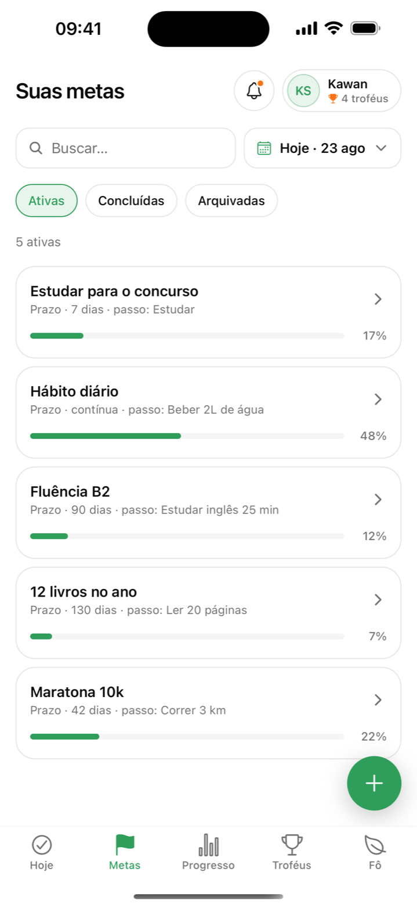
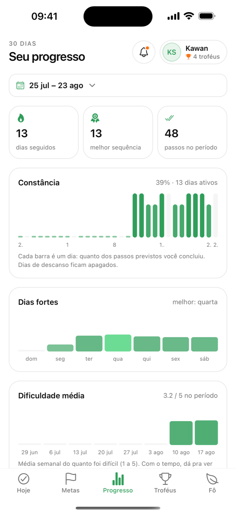
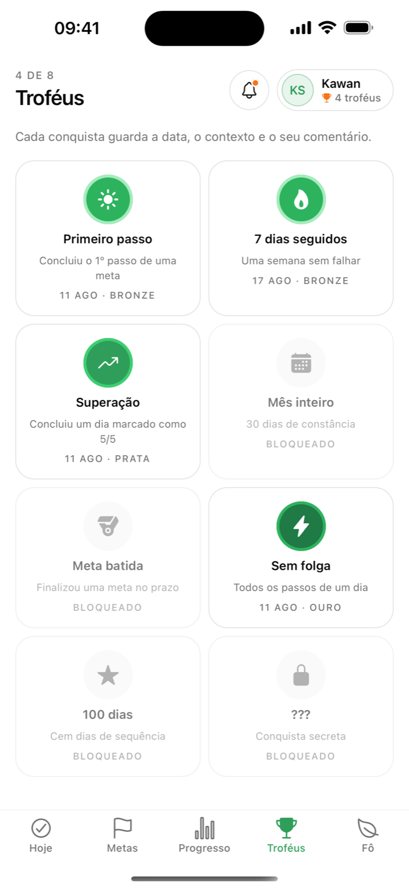
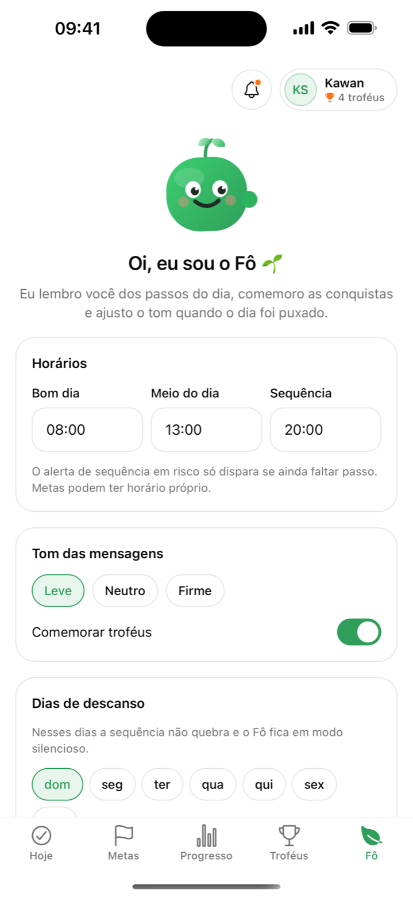

<div align="center">

# 🌱 Foco

**Metas com prazo. Progresso todo dia. Troféus de verdade.**

App full-stack de hábitos e metas: você define um objetivo com prazo e um passo diário,
faz check-in com um toque, registra o quanto foi difícil — e o **Fô**, o lembrete amigável
do app, acompanha seu ritmo com mensagens no tom que você escolher.

[](https://github.com/kawansousa/foco/actions/workflows/ci.yml)
[](../../releases)
[](LICENSE)


📦 **[Baixar a última release (APK Android) →](../../releases/latest)**

</div>

---

## 📱 O app

| Hoje | Metas | Progresso | Troféus | Fô |
| :--: | :--: | :--: | :--: | :--: |
| <picture><source media="(prefers-color-scheme: dark)" srcset="apps/web/public/app/hoje-dark.png"></picture> | <picture><source media="(prefers-color-scheme: dark)" srcset="apps/web/public/app/metas-dark.png"></picture> | <picture><source media="(prefers-color-scheme: dark)" srcset="apps/web/public/app/progresso-dark.png"></picture> | <picture><source media="(prefers-color-scheme: dark)" srcset="apps/web/public/app/trofeus-dark.png"></picture> | <picture><source media="(prefers-color-scheme: dark)" srcset="apps/web/public/app/fo-dark.png"></picture> |

- **Check-in com um toque** e diário de dificuldade (1–5) com comentário
- **Sequência (streak)** que respeita dias de descanso configuráveis
- **Troféus** com data, contexto e a sua história da conquista
- **Filtros por dia ou intervalo** (calendário próprio) nas abas Hoje, Metas e Progresso
- **Análises**: constância por dia, dias fortes da semana, dificuldade média e pizza "como foram os dias" com leitura automática
- **Lembretes locais do Fô** em três tons (leve/neutro/firme) + notificação de "Dia completo!"
- **Tema claro/escuro/sistema**, foto de perfil e busca em todas as listas

## 🧭 Por que este projeto vale a sua atenção

Este é um **monorepo full-stack completo**, escrito em TypeScript estrito de ponta a ponta:

- **Domínio compartilhado de verdade**: tipos, schemas (zod), regras puras de progresso/sequência,
  catálogo de troféus e o cliente HTTP tipado vivem em `packages/shared` — API, app e site consomem o mesmo contrato.
- **API NestJS + Prisma** com autenticação JWT, guard global, validação com zod, rate limiting,
  relógio injetável (testes de regras de data determinísticos) e **137 testes** (unitários + e2e com SQLite real isolado).
- **App Expo (iOS/Android/Web)** com expo-router, notificações locais, tema persistido e componentes próprios
  (calendário de intervalo, gráfico de pizza em SVG, mockup de iPhone na landing).
- **CI/CD com GitHub Actions**: typecheck + testes em cada push; release com APK anexado a cada tag `v*`.

```
apps/
  api/       API HTTP (NestJS + Prisma/SQLite) usada pelo app e pelo site
  mobile/    App de celular (Expo + expo-router, iOS/Android/Web)
  web/       Site/landing (Next.js 16)
packages/
  shared/    Tipos, schemas (zod), regras de progresso/sequência, catálogo de
             troféus, mensagens do Fô e cliente HTTP tipado
```

## 📦 Releases

Cada tag `v*` dispara o workflow de release, que roda os testes, compila o **APK Android**
e publica em **[Releases](../../releases)** com notas geradas automaticamente.

```bash
git tag v0.1.0 && git push origin v0.1.0
```

> O APK é assinado com keystore de debug — ideal para demonstração e instalação direta
> ("fontes desconhecidas"). Para lojas, o caminho é EAS Build. No iOS, rode via Expo (abaixo).

## Rodando tudo

Pré-requisitos: Node 20+, pnpm 9 (`corepack enable`), e para o celular o app **Expo Go** (ou um build de desenvolvimento).

```bash
pnpm install

# 1) API — http://localhost:4000 (aplica as migrations e cria apps/api/data/foco.db sozinha)
pnpm dev:api

# opcional: usuário de demonstração com metas e histórico
pnpm --filter @foco/api seed     # demo@foco.app / foco1234

# 2) Site — http://localhost:3000
pnpm dev:web

# 3) App mobile
pnpm dev:mobile                  # abre o Metro; escaneie o QR com o Expo Go
```

`pnpm dev` sobe API e site juntos.

### Como o app encontra a API

- **Celular físico (Expo Go)**: o app usa automaticamente o IP da máquina que está rodando o Metro, na porta 4000. Celular e computador precisam estar na mesma rede Wi-Fi.
- **Simulador iOS / emulador Android**: `localhost` / `10.0.2.2` automaticamente.
- Para forçar uma URL (ex.: API publicada), crie `apps/mobile/.env` com `EXPO_PUBLIC_API_URL=https://...`.

O site usa `NEXT_PUBLIC_API_URL` (`apps/web/.env.local`), padrão `http://localhost:4000`.

## Funcionalidades

| Recurso (como descrito no site) | Onde vive |
| --- | --- |
| Metas com prazo real (ou contínuas) e passo diário | `POST/GET/PATCH/DELETE /goals`, aba **Metas** |
| Check-in diário com um toque | `PUT /checkins`, aba **Hoje** |
| Diário de dificuldade (1–5) + comentário | modal **Como foi?** depois de marcar o passo |
| Troféus com data, contexto e comentário | `GET /trophies`, `PATCH /trophies/:id`, aba **Troféus** |
| Lembretes com o Fô (horários, tom leve/neutro/firme, dias de descanso, modo silencioso) | `GET/PUT /settings`, `GET /fo/schedule`, aba **Fô** → notificações locais |
| Progresso: constância, dificuldade média, dias fortes | `GET /stats`, aba **Progresso** |
| Lista de espera do site | `POST /waitlist` (formulário da landing) |

Regras de troféu (`apps/api/src/trophies/trophy-rules.ts`): Primeiro passo, 7 dias seguidos, Superação (dia 5/5), Mês inteiro (30), Meta batida (concluída no prazo), Sem folga (todos os passos do dia), 100 dias e um troféu secreto.

Sequência e progresso são funções puras em `packages/shared/src/progress.ts` — dias de descanso não quebram a sequência.

## API

Autenticação por `Authorization: Bearer <token>` (JWT). Datas são `YYYY-MM-DD` no fuso do cliente (mande `?date=` nas rotas de leitura).

```
POST /auth/register {name,email,password}     POST /auth/login {email,password}     GET|PATCH /me
POST /auth/logout-all  (invalida todos os tokens; devolve um novo para quem chamou)
GET  /goals?date=   POST /goals   GET|PATCH|DELETE /goals/:id   POST /goals/:id/complete
GET  /today?date=                              PUT /checkins {goalId,date,done,difficulty?,note?,localTime?}
GET  /checkins?from&to&goalId
GET  /trophies      PATCH /trophies/:id {note}
GET  /settings      PUT /settings
GET  /stats?date=   GET /fo/schedule?date=
POST /waitlist {email,source?}                 GET /health
```

Variáveis (`apps/api/.env.example`): `PORT`, `DATABASE_URL`, `JWT_SECRET` (obrigatório em produção), `CORS_ORIGINS`, `RATE_LIMIT_AUTH_PER_MIN` / `RATE_LIMIT_PER_MIN` (por IP e minuto: login+cadastro somam num balde só, padrão 10; demais rotas 300 por rota) e `TRUST_PROXY` (obrigatório atrás de proxy reverso para o limite valer por cliente, ex.: `TRUST_PROXY=1`). Contadores em memória, por processo — com réplicas, usar um storage compartilhado.

### Estrutura (NestJS)

```
apps/api/
  prisma/schema.prisma      modelo de dados + migrations (prisma/migrations)
  prisma/seed.ts            usuário demo (passa pelos serviços da API)
  src/
    main.ts, app.module.ts, app.setup.ts   bootstrap (CORS, guard global, filtro de erros)
    config/                 env validado com zod (falha cedo), caminho do SQLite
    prisma/                 PrismaService (driver adapter better-sqlite3)
    common/                 Clock injetável, guard JWT + @Public/@CurrentUser,
                            ZodValidationPipe (schemas do @foco/shared), filtro { error, issues }
    auth/ users/ settings/ goals/ checkins/ trophies/ progress/ waitlist/ health/
                            um módulo por domínio: controller (HTTP) + service (regras)
  test/                     testes e2e (supertest) com SQLite real isolado por arquivo
```

Mudou o schema? `pnpm --filter @foco/api db:migrate:dev --name <nome>` gera a migration e regenera o client. `pnpm dev:api` e `pnpm --filter @foco/api start` aplicam as migrations pendentes antes de subir (`prisma migrate deploy`).

A API roda TypeScript direto via SWC (`apps/api/swc-register.cjs`, só arquivos `.ts`). Se você usa a extensão **Console Ninja** no VS Code: ela altera `node_modules/@nestjs/core/index.js`; o `register.cjs` já ignora o JS injetado, então não precisa desativá-la.

### Testes

```bash
pnpm test                               # unitários + e2e
pnpm --filter @foco/api test:watch
pnpm --filter @foco/api test:cov        # cobertura (threshold mínimo configurado)
```

- Unitários (`src/**/*.spec.ts`): regras de troféu, hash de senha, pipes, filtro de erros, mappers, validação de env.
- E2E (`test/*.e2e-spec.ts`): sobem a aplicação inteira contra uma cópia própria de um banco SQLite migrado (nunca tocam em `data/foco.db`), com relógio congelado (`Clock`) para testar regras de data. Cobrem cada rota e regra: isolamento entre usuários (404, nunca vaza), validações (400 com `issues`), idempotência do check-in, troféus (sem duplicar, por meta, sequência com dias de descanso), mensagens do Fô, estatísticas, lista de espera.

## Scripts úteis

```bash
pnpm typecheck        # todos os pacotes
pnpm build            # site + typecheck da API
pnpm test             # testes da API
pnpm --filter @foco/web lint
```

## Site (apps/web)

Next.js 16 (App Router) + Tailwind v4 + shadcn/ui + `motion`. A hero mostra uma demo interativa da tela "Hoje" dentro de um iPhone (`src/components/landing/phone-mockup.tsx`); o app de verdade é o `apps/mobile`.

- Cores: `src/app/globals.css` (`:root` e `.dark`).
- Textos: cada seção em `src/components/landing/*`.
- Avatar: `src/components/avatar/fo-avatar.tsx` (`mood`: `happy | wave | celebrate | sleepy | thinking`). A versão nativa está em `apps/mobile/src/components/fo-avatar.tsx`.
